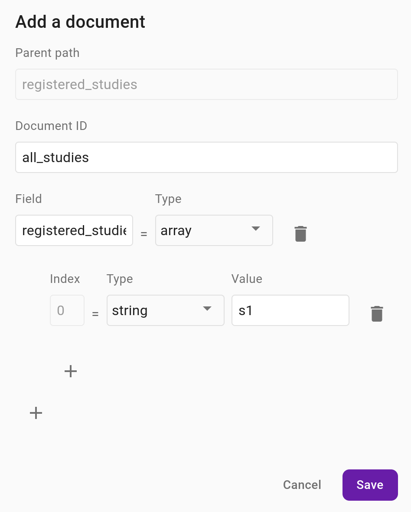
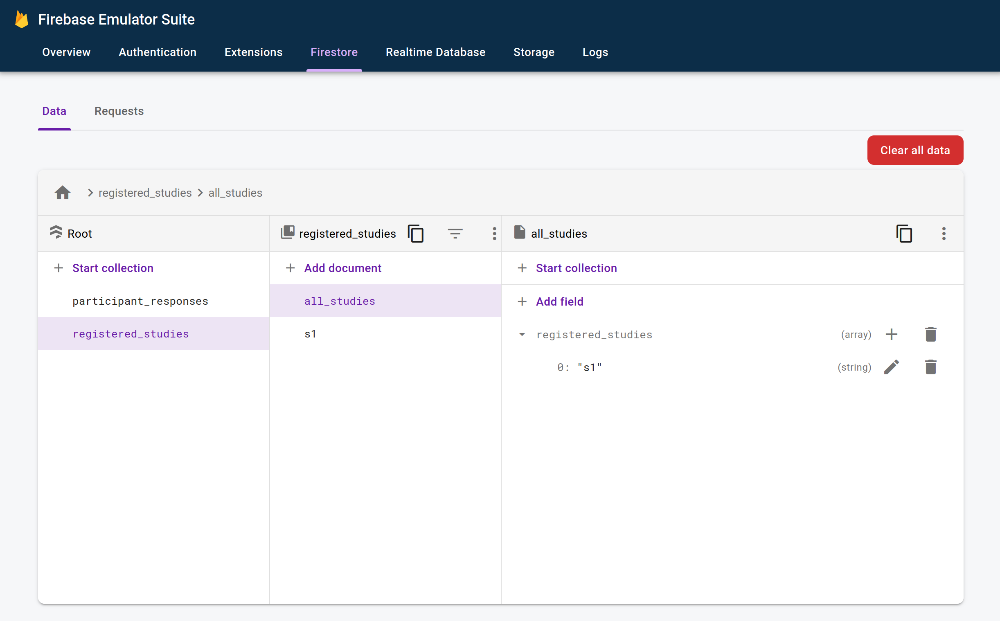

# Human Multidimensional Changepoint Detection Task

See the [Honeycomb Documentation](https://honeycomb.ccv.brown.edu/) page 
for details on how to use the honeycomb ecosystem.

## Installation

There are several prerequisites before the repo can be installed directly. Take
a look at the [Honeycomb Prerequisites](https://honeycomb.ccv.brown.edu/docs/prerequisites)
page to them in detail, but the basic list is as follows:
- [Git](https://git-scm.com/)
- [Node Version Manager](https://github.com/nvm-sh/nvm)
- [Python](https://www.python.org/)
- [Oracle JDk](https://www.oracle.com/java/)

Then you can install the packages required for the repo:
```bash
npm install
```

## Running Locally

The task is setup to run on Firebase but can be run locally for development purposes.
To do this you will need two terminals, one to run the task and the other to run 
the firebase emulator.

In one terminal, run the following:
```bash
npm run dev:firebase
```

If your code has no issues, it should say that webpack compiled successfully. In 
another terminal:
```bash
npm run firebase:emulators:start
```

Due to the firestore rules (as of v1.0.0 of the task), you will need to modify
the database for the task to run properly. The emulator should havs started a UI
in http://127.0.0.1:4000/firestore, so navigate to this page. Click on `registered_studies`
on the left, then click on `Add document`, and then fill it out as shown below:

<div align="center">
	
</div>

Under `Document ID` enter "all_studies", for `Field`, enter "registered_studies", 
set `Type` to be `array`, then click on the `+` symbol and add a `string` with 
`Value` set to "s1". Finally, click on `Save`. The resulting page should look
like this:

<div align="center">
	
</div>

## Deployment

The live version of the task is deployed from the main branch on Github via
the [`Deploy to Firebase Hosting on merge`](https://github.com/APRashedAhmed/human-mdcpd-honeycomb/actions/workflows/firebase-hosting-merge.yml) 
github action to the following URL:

> [https://human-mdcpd-honeycomb-6b769.web.app/](https://human-mdcpd-honeycomb-6b769.web.app/)

Note that the github action will redeploy the task on every change to the `main`
branch, therefore be mindful of when updates are made to it if experiments are
ongoing.
